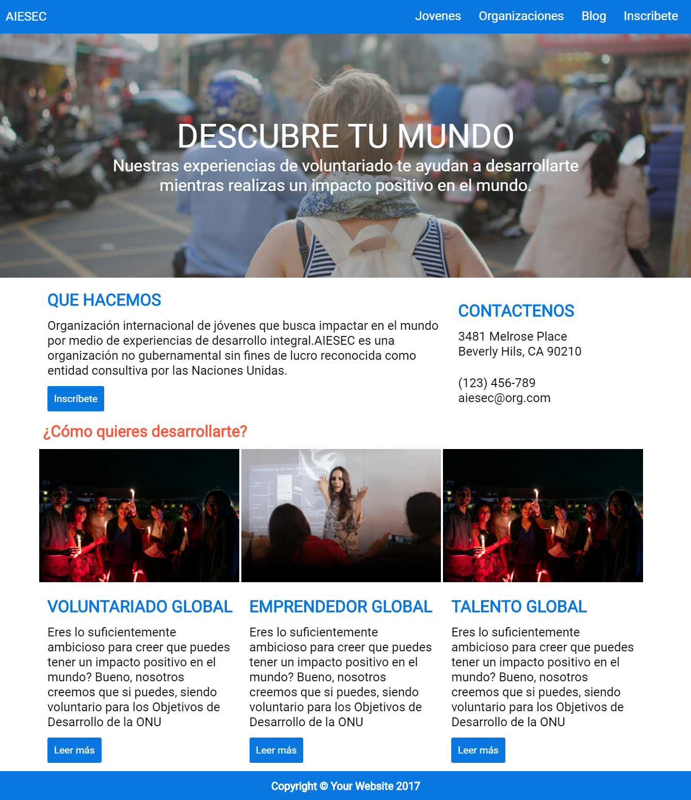

## RETO DE CODIGO MY PAGE  
En el siguiente trabajo se realizó una web responsive con la técnica **móvile first** la cual se adapta a diferentes vistas.

  

## Desarrollado para [Laboratoria](http://talento.laboratoria.la/)  

### Herramientas Tecnologicas
Se utilizó:  
- CSS3 (Grid System & @Media Queries)  
- HTML5  

### Producto Final

